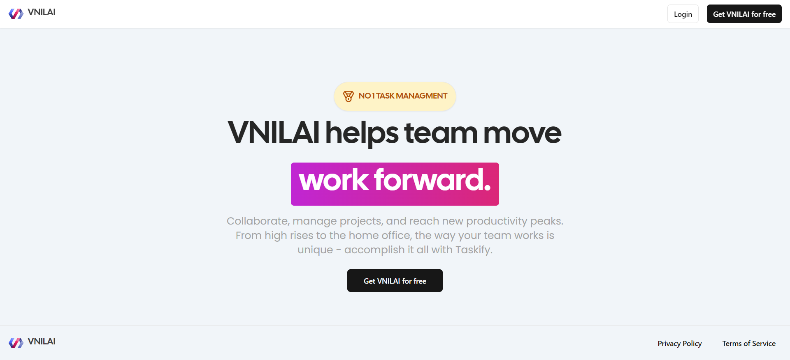
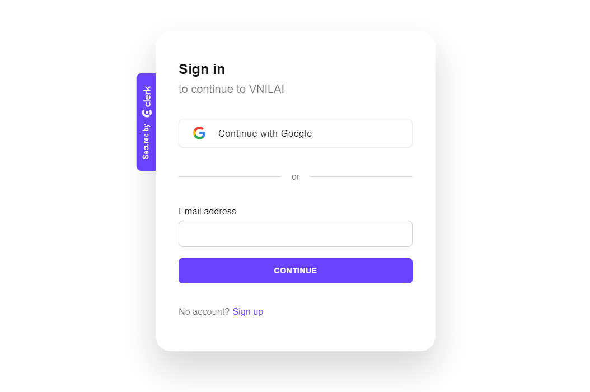
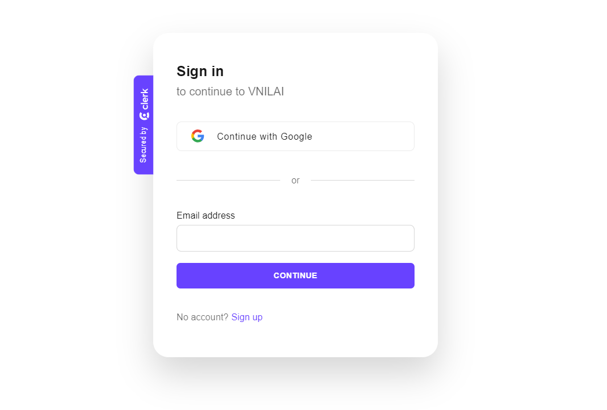
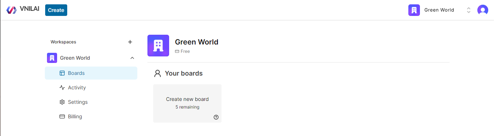
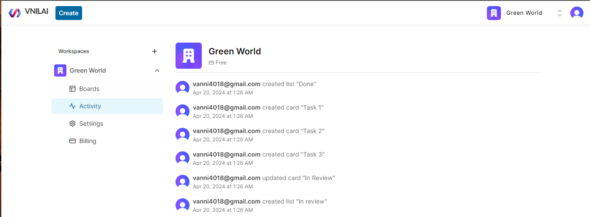

# Task Management Software
  

# Some features:

⚛️ Tech stack: Next.js 14, Server Actions, React, Prisma, Tailwind,
MySQL

🔐 Authentication & Authorization with Clerk

📝 Organizations / Workspaces  
💬 + List/Card creation, rename, delete, drag & drop reorder and copy

🌐 Deployment

⏳ And much more!  
  
  
# Login  
  
  
Sign-up  

# Workspaces  

# Board

# Card

# Activity

  
  
And more …
